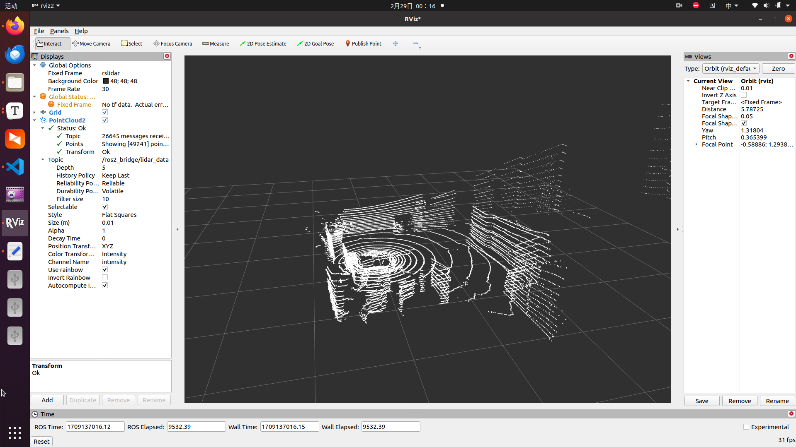

# 激光雷达驱动与Rviz可视化
# Dora版本

参考：https://dora.carsmos.ai/docs/guides/Installation/installing

```bash
export DORA_VERSION=v0.3.2 # Check for the latest release
export ARCHITECTURE=$(uname -m)
wget https://github.com/dora-rs/dora/releases/download/${DORA_VERSION}/dora-${DORA_VERSION}-${ARCHITECTURE}-Linux.zip
unzip dora-${DORA_VERSION}-${ARCHITECTURE}-Linux.zip
pip install dora-rs==${DORA_VERSION}
PATH=$PATH:$(pwd)
dora --help
```

## 激光雷达驱动安装

参考：https://blog.csdn.net/crp997576280/article/details/135376558
rs_driver git仓库：https://blog.csdn.net/crp997576280/article/details/135376558

```bash
git clone https://github.com/RoboSense-LiDAR/rs_driver.git
# 安装编译所需依赖
sudo apt-get install libpcap-dev libeigen3-dev libboost-dev libpcl-dev
# 编译rs_driver
cd rs_driver
mkdir build && cd build
cmake .. && make -j4
# 安装rs_driver
sudo make install
```
## 编译激光雷达dora驱动
将rslidar_driver.cc中的dora头文件修改成自己电脑上的路径
```cpp
extern "C"
{
#include "/home/crp/dora_project/dora-rs/dora/apis/c/node/node_api.h"   
#include "/home/crp/dora_project/dora-rs/dora/apis/c/operator/operator_api.h"
#include "/home/crp/dora_project/dora-rs/dora/apis/c/operator/operator_types.h"
}
```
运行编译脚本</br>
需要先将build.sh中的路径 -L /home/dora/dora_project/dora-rs/target/release，修改为自己电脑上的dora路径
```bash
mdkir build
bash build.sh
```
## Rviz2可视化
参考：https://blog.csdn.net/MRFantastic/article/details/135956340?spm=1001.2014.3001.5501
```bash
dora start dataflow.yml --name test
```
如果直接可视化激光雷达驱动发送的数据，运行数据流文件dataflow.yml，创建一个ros话题： *ros2_bridge/lidar_data*,启动Rviz2，通过话题添加PointCloud2可以显示激光雷达数据。<br>
如果激光雷达数据不是直接来源于激光雷达驱动，需要修改dataflow.yml中：

```yaml
nodes:
  #rslidar driver   node
  - id: rslidar_driver
    custom:
      source: build/rslidar_driver
      inputs:
        tick: dora/timer/millis/100
      outputs:
        - pointcloud

  - id: lidar_to_ros2
    operator:
        python: lidar_to_ros2.py
        inputs:
          pointcloud: rslidar_driver/pointcloud
```
将inputs中的pointcloud修改需要接收的激光雷达消息。在lidar_to_ros2.py中，在on_event函数中对接收到的数据进行处理。dora_event["value"]存储了接收到的数据，需要将点云坐标保存为一个列表：
```python
points = [
    [10, 10, 10], # point1的XYZ坐标
    [20, 20, 20], # point2的XYZ坐标
    ...
]
```
根据接收到的数据修改lidar_data_dict这个字典
```python
lidar_data_dict = {
    "header": {
        "stamp": {
            "sec": np.int32(sec),
            "nanosec": np.uint32(nanosec),
        },
        "frame_id": "rslidar",
    },
    "height": np.uint32(1),
    "width": np.uint32(len(points)),
    "fields":[{"name": "x", "offset": np.uint32(0), "datatype": np.uint8(7), "count": np.uint32(1)}, 
              {"name": "y", "offset": np.uint32(4), "datatype": np.uint8(7), "count": np.uint32(1)},
              {"name": "z", "offset": np.uint32(8), "datatype": np.uint8(7), "count": np.uint32(1)},],
    "is_bigendian": False,
    "point_step": np.uint32(12),
    "row_step": np.uint32(len(points)),
    "data": points.ravel().view(np.uint8),#np.asarray(points, np.float32).ravel().view(np.uint8),
    "is_dense": False,
}
```

# 激光雷达录制数据PCAP文件在Rviz2可视化

```bash
dora start dataflow_PCAP.yml --name test
```

可以在ros2看见话题： *ros2_bridge/lidar_data*,启动Rviz2，通过话题添加PointCloud2可以显示激光雷达数据。

